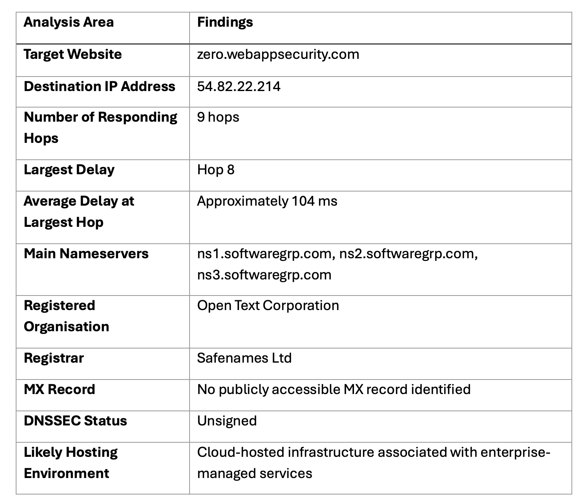

Unit 3 Activity 1 – Network Reconnaissance and Basic Scanning

Using the website(s) assigned to you in Unit 1, carry out the following exercises and answer the questions listed below. Ideally, you should complete this task before the next seminar, where it will be discussed further. Your findings/results from this exercise will be utilised specifically for the preparation of the 'Vulnerability Audit and Assessment - Results and Executive Summary' assessment in Unit 6.

Instructions

Perform a basic scan using standard tools such as traceroute, dig and nslookup. Please see these instructions on using traceroute, etc. Refer to this week's reading for further assistance. Do not use ping as it will cause confusion because of shared addresses.

Use these basic tools and make a list that details the following information:

-How many hops from your machine to your assigned website?

-Which step causes the biggest delay in the route? What is the average duration of that delay?

-What are the main nameservers for the website?

-Who is the registered contact?

-What is the MX record for the website?

-Where is the website hosted?
______________
1.Introduction

This activity involved conducting a basic reconnaissance and infrastructure analysis of the assigned website, zero.webappsecurity.com, using standard network diagnostic and DNS analysis tools available within Kali Linux. The objective of the exercise was to gather network and domain information relating to the target website through non-intrusive scanning techniques including traceroute, dig, nslookup and whois analysis.
The activity focused on identifying routing behaviour, DNS infrastructure, domain registration information and mail exchange configuration in order to support vulnerability assessment and information gathering processes commonly used within cyber security reconnaissance activities (OWASP, 2025).
 
2.Findings and Results

 
3.Analysis

Traceroute analysis identified nine responding network hops between the local Kali Linux environment and the destination website before subsequent responses became unavailable due to network filtering or ICMP restrictions. The destination resolved to IP address 54.82.22.214, suggesting cloud-hosted infrastructure, likely associated with enterprise cloud hosting services.
The largest latency increase occurred at hop 8, where the average response time was approximately 104 milliseconds. This delay likely resulted from long-distance backbone routing and traversal into US-based infrastructure. Several later traceroute hops returned * * * responses, indicating ICMP filtering or firewall restrictions commonly implemented within enterprise and cloud-hosted environments for security purposes (OWASP, 2025).
DNS analysis using dig identified the authoritative nameservers associated with the domain as ns1.softwaregrp.com, ns2.softwaregrp.com and ns3.softwaregrp.com. These findings suggest that the domain infrastructure is managed through enterprise DNS services associated with OpenText and former Micro Focus infrastructure.

WHOIS analysis identified the registered organisation as Open Text Corporation and the domain registrar as Safenames Ltd, a company specialising in enterprise domain management and online brand protection services. Administrative and registrant information was partially protected through privacy controls, reducing the exposure of sensitive organisational contact information during reconnaissance activities (ICANN, 2025).

MX record analysis did not identify any publicly accessible mail exchange records for the domain. This may indicate that email services are externally managed, intentionally restricted from public exposure or not configured directly for the queried domain. Restricting publicly visible DNS information may reduce infrastructure exposure during reconnaissance activities and limit information available to potential attackers.

WHOIS analysis additionally revealed that DNSSEC protections were not publicly enabled for the domain, as indicated by the DNSSEC: unsigned status. DNSSEC is designed to protect DNS integrity and reduce the risk of DNS spoofing or cache poisoning attacks (Cloudflare, 2025). Although the absence of DNSSEC does not necessarily represent a direct vulnerability, it may theoretically increase exposure to DNS-related attacks.

Overall, the reconnaissance activity demonstrated several characteristics consistent with enterprise-managed infrastructure, including restricted infrastructure visibility, controlled DNS exposure and cloud-hosted routing behaviour.
 
4.Reflection

Challenges Encountered

One of the primary challenges encountered during the activity involved interpreting incomplete traceroute and DNS responses. Several traceroute hops failed to respond and returned * * *, initially creating uncertainty regarding whether the scan had failed or whether the target infrastructure was inaccessible. Additional confusion occurred during MX record analysis because no publicly accessible MX records were returned for the queried domain.
Another challenge involved understanding DNS hierarchy and domain delegation. Initial DNS queries performed against the subdomain did not return direct nameserver information, requiring additional analysis of the parent domain in order to identify authoritative DNS infrastructure.

How the Challenges Were Overcome

These challenges were overcome through additional research into traceroute behaviour, ICMP filtering and DNS delegation concepts. Repeating scans and comparing the results of dig, whois and parent-domain DNS queries improved understanding of how enterprise environments intentionally limit infrastructure visibility for security purposes.
Further analysis of WHOIS information and DNS authority records also helped clarify the relationship between the target website and enterprise-managed infrastructure associated with OpenText and Micro Focus services.

Impact on the Final Report

The challenges encountered during the activity positively influenced the final report by encouraging a more analytical and evidence-based approach to network reconnaissance and vulnerability assessment. The activity improved understanding of cloud-hosted infrastructure, enterprise DNS management and security controls designed to reduce publicly exposed infrastructure information.
The exercise also demonstrated the importance of interpreting incomplete scan results carefully rather than assuming that missing responses indicate technical failure. This experience contributed to a more realistic understanding of how modern organisations implement defensive infrastructure configurations and network filtering techniques to limit reconnaissance visibility.
 
5.Conclusion

The activity successfully demonstrated the use of basic reconnaissance and DNS analysis tools to gather information regarding network routing, domain management and hosting infrastructure associated with the assigned website. The use of traceroute, dig, nslookup and whois analysis provided valuable insight into enterprise-managed DNS services, cloud-hosted infrastructure and defensive visibility controls.
The findings additionally demonstrated how modern organisations implement security and privacy measures such as ICMP filtering, domain privacy protection and restricted DNS exposure to reduce publicly available infrastructure intelligence. Overall, the exercise improved understanding of reconnaissance methodologies and their role within vulnerability assessment and cyber security analysis.
 
6.References

Cloudflare (2025) What is DNSSEC? Available at: Cloudflare DNSSEC Learning Center.

ICANN (2025) WHOIS and RDAP Information. Available at: ICANN WHOIS Information.

National Institute of Standards and Technology (NIST) (2025) National Vulnerability Database. Available at: NIST National Vulnerability Database.

Open Worldwide Application Security Project (OWASP) (2025) OWASP Web Security Testing Guide. Available at: OWASP Testing Guide.

Orzach, Y. and Khanna, D. (2022) Network Protocols for Security Professionals. Birmingham: Packt Publishing.

