Unit3 Nessus Vulnerability Scan:

Instructions 

Step 1: Setup

Download and install Nessus Essentials (free) from Tenable. 
Set it up on a VM or host machine (Linux or Windows). 
Register with a free activation code to unlock scanning features. 

Step 2: Define Scope 

Choose a target machine  
Record the target’s IP address. 
Ensure the target machine is on the same network as the Nessus scanner. 

Step 3: Run a Scan 

In Nessus, create a new scan using the Basic Network Scan template. 
Enter the target IP address. 
Start the scan and monitor progress from the Nessus dashboard. 

Step 4: Review the Results 

When the scan completes, Nessus will categorise vulnerabilities into: 
Critical 
High 
Medium 
Low 
Informational 
Note down examples of vulnerabilities in each category (at least one per level). 
Export the results (HTML or PDF) for your reference. 

Step 5: Write Your Vulnerability Assessment Report 

Your report should include the following sections: 

-Introduction
Purpose of the scan.
Why automated vulnerability scanning is useful.
-Methodology
How you set up Nessus and configured the scan.
The target machine chosen. 
-Findings
A summary table showing how many vulnerabilities were found in each category.
Examples of specific vulnerabilities (with CVE IDs if available).
-Analysis
Brief discussion of the most serious vulnerabilities.
What risks they pose.
-Recommendations
Steps you would suggest to fix or mitigate the vulnerabilities.
-Reflection
How this exercise demonstrates automated vulnerability scanning.
Why Nessus was appropriate for this task.
What you learned from reviewing the results. 

---------
1. Introduction
   
Cybersecurity vulnerability assessments are critical components of modern information security management. Organisations use vulnerability assessments to identify weaknesses, misconfigurations, and outdated software that may expose systems to cyberattacks. By proactively detecting vulnerabilities, organisations can reduce security risks and improve overall system resilience (Scarfone and Mell, 2008).
Automated vulnerability scanners such as Nessus are widely used to identify known Common Vulnerabilities and Exposures (CVEs), insecure configurations, and outdated software packages (Tenable, 2025). Vulnerability scanning helps organisations prioritise remediation activities according to risk severity and exploitability.
This report presents a vulnerability assessment conducted using Nessus Essentials within a Kali Linux virtual machine environment deployed using UTM virtualisation software. The assessment focused on scanning the localhost system (127.0.0.1) to identify vulnerabilities affecting installed services and applications.
The scan identified multiple vulnerabilities related to outdated ImageMagick software packages, including several high-severity findings associated with memory corruption and heap overflow risks. The report analyses the identified vulnerabilities, evaluates associated risks, and recommends remediation strategies to improve system security posture.
 
2. Objectives
   
The objectives of this vulnerability assessment were:
•	To deploy a Kali Linux virtual machine using UTM.
•	To install and configure Nessus Essentials.
•	To perform a vulnerability scan against the localhost environment.
•	To identify and analyse discovered vulnerabilities.
•	To evaluate the severity and potential impact of detected vulnerabilities.
•	To recommend remediation and mitigation strategies.
•	To demonstrate understanding of vulnerability management principles.
 
3. Scope of Assessment
   
The assessment scope included the following components:
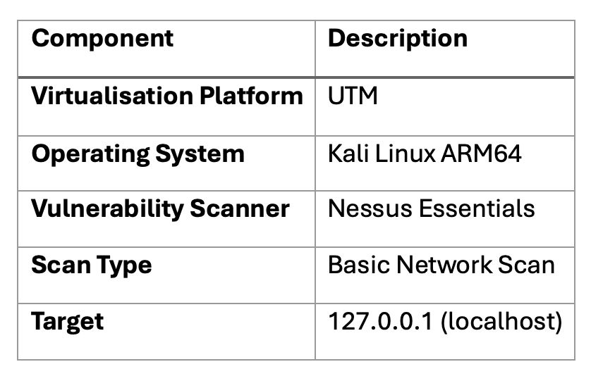

The assessment was limited to the local virtual machine environment and did not include external production systems or cloud infrastructure.
 
4. Tools and Environment
   
4.1 UTM Virtualisation Software

UTM was used as the virtualisation platform to deploy the Kali Linux environment on macOS. UTM supports ARM64 virtualisation and enables the execution of Linux operating systems on Apple Silicon hardware (UTM, 2025).

4.2 Kali Linux

Kali Linux is a Debian-based Linux distribution specifically designed for penetration testing and cybersecurity research. It includes numerous pre-installed security assessment tools and utilities commonly used within cybersecurity operations (Kali Linux, 2025).

4.3 Nessus Essentials

Nessus Essentials is a vulnerability assessment solution developed by Tenable. It enables users to identify vulnerabilities, outdated software, insecure configurations, and known CVEs within systems and networks (Tenable, 2025).

Key Nessus capabilities include:
•	Vulnerability identification
•	CVSS-based severity scoring
•	Security auditing
•	Compliance checking
•	Remediation recommendations
 
5. Methodology
   
The vulnerability assessment followed a structured methodology consisting of environment preparation, scanner configuration, vulnerability scanning, and result analysis.
 
5.1 Virtual Machine Preparation

A Kali Linux ARM64 virtual machine was deployed using UTM. During the setup process, the virtual hard disk was expanded from approximately 30 GB to 70 GB to support Nessus installation and scanning requirements.
Disk resizing was completed using GParted partition management tools. The EXT4 filesystem was successfully expanded after modifying disk partitions and reallocating unallocated space.

The final storage allocation was verified using:
df -h
The system confirmed approximately 68 GB of available storage on the root partition.
 
5.2 Nessus Installation and Configuration

Nessus Essentials was installed within the Kali Linux virtual machine environment. The Nessus service was started and accessed using the local web interface:
https://localhost:8834
The Nessus activation process was completed using a valid Nessus Essentials activation code provided by Tenable.
 
5.3 Vulnerability Scan Configuration

A Basic Network Scan policy was configured using Nessus Essentials.
The localhost system was selected as the scan target:
127.0.0.1
The scan was executed using the local Nessus scanner integrated within the Kali Linux virtual machine.
 
5.4 Vulnerability Analysis

After scan completion, identified vulnerabilities were analysed according to:
•	Severity level
•	CVSS score
•	Exploitability
•	Potential impact
•	Remediation recommendations

The vulnerabilities were categorised into High, Medium, and Informational severity levels.

 
6. Vulnerability Assessment Results
The Nessus vulnerability scan identified multiple vulnerabilities affecting the localhost environment.

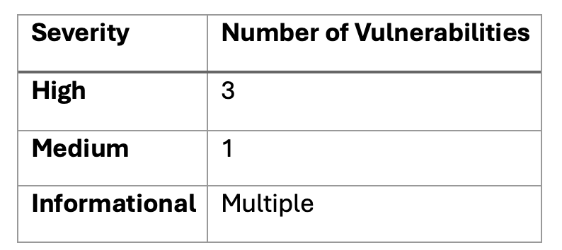
The majority of identified vulnerabilities were associated with outdated ImageMagick software packages.

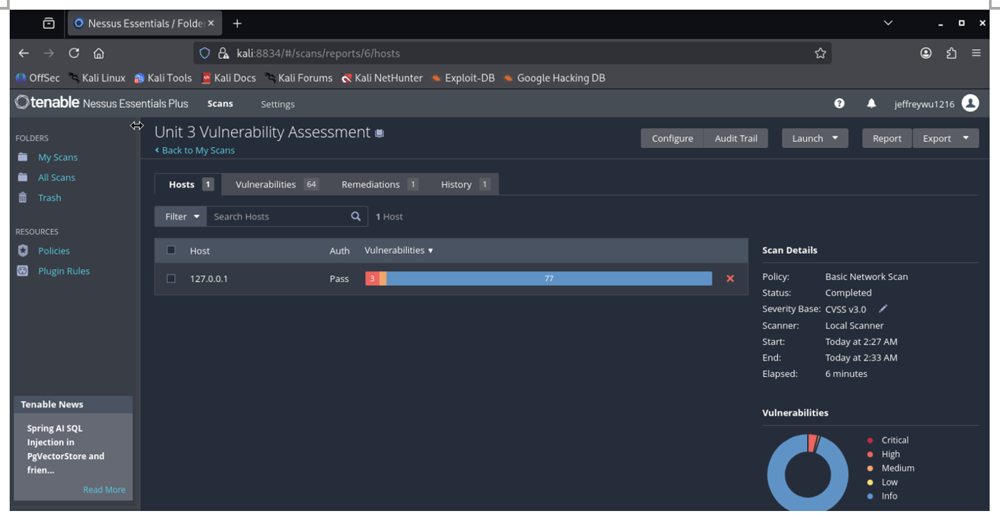
Figure 1: Nessus Vulnerability Scan Overview

The scan overview displayed the total number of identified vulnerabilities categorised by severity levels.

 
6.1 High Severity Vulnerability 1
ImageMagick < 6.9.13-41 / 7.x < 7.1.2-16 Multiple Vulnerabilities

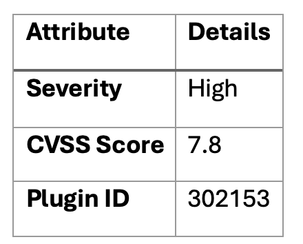

Description

The installed ImageMagick version was identified as vulnerable to multiple security flaws involving heap overflow, heap over-read, and symlink race conditions.

ImageMagick is widely used for image processing and manipulation. Vulnerabilities affecting image processing libraries may allow attackers to exploit crafted image files to trigger memory corruption issues (MITRE, 2025).

Impact

Potential impacts include:
•	Arbitrary code execution
•	Denial of service
•	System instability
•	Memory corruption

Recommendation

Upgrade ImageMagick to:
6.9.13-41 or later
7.1.2-16 or later
 
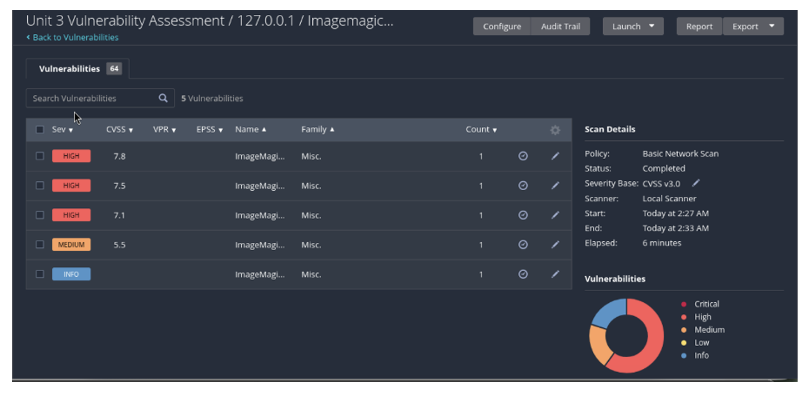 
 
Figure 2: High Severity Vulnerability – CVSS 7.8

The vulnerability details page displayed the vulnerability description, CVSS score, plugin details, and remediation guidance.
 
6.2 High Severity Vulnerability 2

ImageMagick < 6.9.13-44 / 7.x < 7.1.2-19 Multiple Vulnerabilities
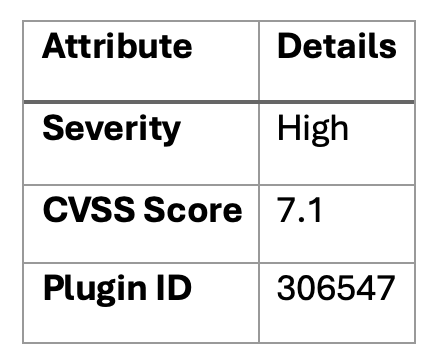

Description

The vulnerability scan identified additional ImageMagick vulnerabilities involving:
•	Heap buffer overflow
•	XML parser stack exhaustion
•	Out-of-bounds memory writes

These vulnerabilities may be exploited using malformed image files or malicious processing requests.

Impact

Potential exploitation may result in:
•	Denial of service attacks
•	Application crashes
•	Arbitrary memory manipulation

Recommendation

Upgrade ImageMagick to:
6.9.13-44 or later
7.1.2-19 or later
 
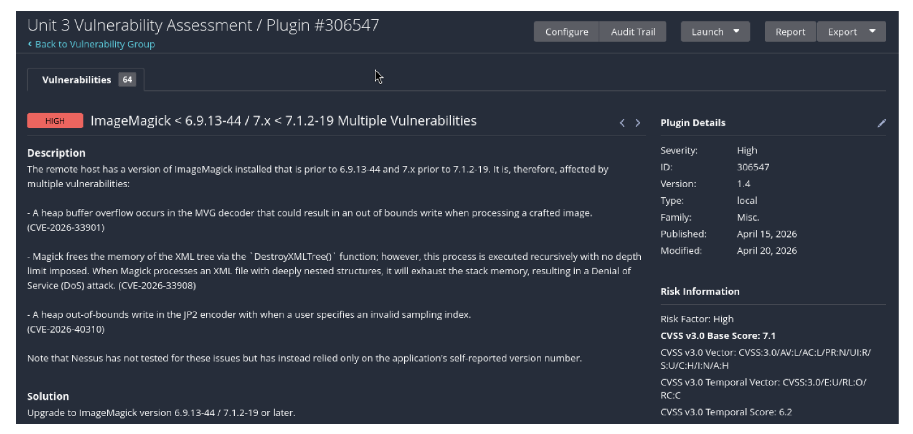

Figure 3: High Severity Vulnerability – CVSS 7.1
The Nessus plugin report displayed technical details and remediation instructions associated with the vulnerability.

6.3 High Severity Vulnerability 3

Additional ImageMagick Vulnerabilities

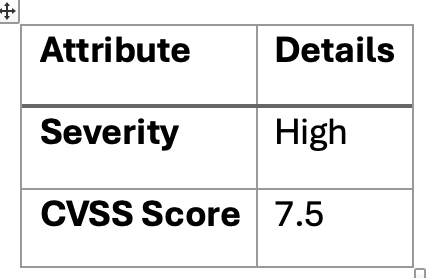

Description

Additional vulnerabilities were identified affecting ImageMagick image processing components.
The vulnerabilities involved memory corruption and improper handling of image parsing operations.

Impact

Potential impacts include:
•	Service disruption
•	Denial of service
•	Privilege escalation opportunities

Recommendation

Apply the latest ImageMagick security updates and maintain regular software patching schedules.
 
6.4 Medium Severity Vulnerability

ImageMagick < 6.9.13-43 / 7.x < 7.1.2-18 Multiple Vulnerabilities
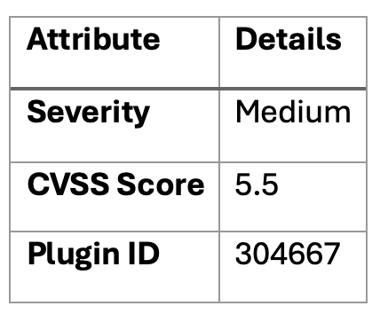

Description

The installed ImageMagick version contained medium-severity vulnerabilities associated with:
•	Out-of-bounds memory writes
•	Pointer mismanagement
•	Potential application crashes

Impact

Possible impacts include:
•	Reduced application stability
•	Service interruption
•	Memory corruption

Recommendation

Upgrade ImageMagick to:
6.9.13-43 or later
7.1.2-18 or later

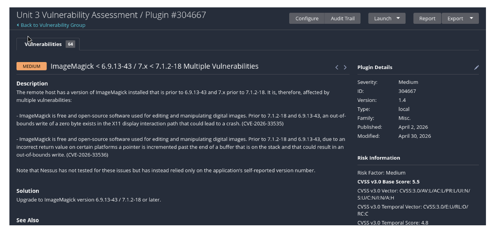 

Figure 4: Medium Severity Vulnerability – CVSS 5.5

The Nessus report displayed medium-risk vulnerabilities alongside associated CVEs and remediation guidance.

6.5 Remediation Summary
The Nessus remediation report recommended upgrading vulnerable ImageMagick packages to secure versions.
 
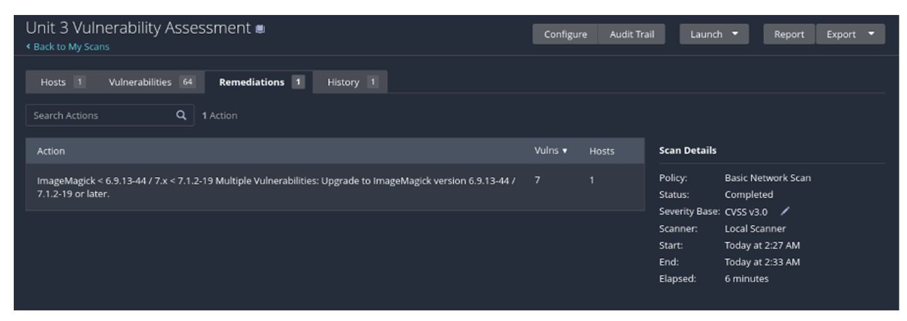

Figure 5: Nessus Remediation Recommendations

The remediation tab summarised the recommended upgrade actions required to address identified vulnerabilities.

 
7. Risk Analysis
   
The identified vulnerabilities present moderate-to-high cybersecurity risks due to the widespread use of ImageMagick within Linux systems and web applications.
 
7.1 Threat Exposure

Outdated software increases attack surface exposure and creates opportunities for malicious exploitation. Memory corruption vulnerabilities such as heap overflows and out-of-bounds writes are particularly dangerous because they may allow attackers to execute arbitrary code or disrupt service availability (MITRE, 2025).
 
7.2 Likelihood of Exploitation

The vulnerabilities identified within the Nessus scan are publicly documented CVEs with published technical information.
Factors increasing exploitation likelihood include:

•	Public vulnerability disclosure
•	Outdated software packages
•	Lack of patch management
•	Publicly available exploit techniques
 
7.3 Business Impact

If exploited within a production environment, the identified vulnerabilities may lead to:
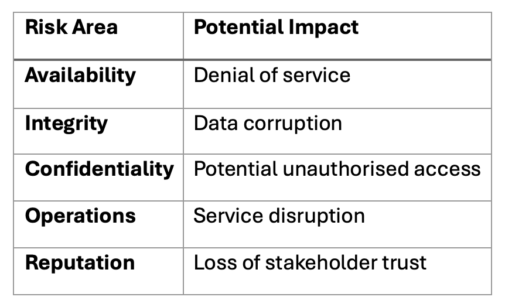

 
8. Remediation Recommendations
   
Several remediation actions are recommended to reduce system exposure.
 
8.1 Apply Security Updates

Regularly update vulnerable software packages using:
sudo apt update && sudo apt upgrade
 
8.2 Enable Automatic Updates

Automatic security updates reduce exposure windows associated with newly disclosed vulnerabilities.
 
8.3 Conduct Continuous Vulnerability Scanning

Organisations should perform regular vulnerability assessments to identify newly emerging threats and ensure patch compliance.
 
8.4 Implement Principle of Least Privilege

Restrict unnecessary permissions to minimise the impact of potential exploitation.
 
8.5 Monitor Security Logs

Implement:

•	security monitoring
•	intrusion detection
•	system logging
•	audit monitoring

to improve threat detection capabilities.
 
9. Critical Evaluation
   
Although Nessus Essentials successfully identified multiple vulnerabilities affecting the localhost system, vulnerability scanners have limitations.

Automated vulnerability scanners may occasionally generate false positives or rely on software self-reported version numbers rather than direct exploit verification. As a result, vulnerability assessment results should be complemented with manual verification and security testing techniques.

Additionally, Nessus Essentials provides limited scanning capabilities compared to enterprise vulnerability management platforms. However, it remains highly effective for educational environments, small networks, and introductory cybersecurity assessments.
The assessment demonstrated the effectiveness of Nessus in identifying known vulnerabilities and providing remediation guidance while highlighting the importance of maintaining secure software update practices.
 
10. Conclusion
    
This vulnerability assessment successfully demonstrated the deployment and use of Nessus Essentials within a Kali Linux virtual machine environment.

The scan identified multiple vulnerabilities associated with outdated ImageMagick software packages, including several high-severity findings involving memory corruption and heap overflow risks. The assessment highlighted the importance of proactive vulnerability management, regular patching, and continuous security monitoring.

The results demonstrate how automated vulnerability scanning contributes to improving cybersecurity resilience and reducing organisational exposure to known vulnerabilities. Overall, Nessus Essentials proved to be an effective vulnerability assessment tool capable of identifying security weaknesses and providing actionable remediation guidance.
 
11. Reflection
    
This exercise demonstrated the practical value of automated vulnerability assessment tools within cybersecurity operations. The use of Nessus Essentials provided insight into how organisations identify and prioritise security weaknesses within systems and applications. Automated vulnerability scanners are widely used because they allow security professionals to rapidly detect known vulnerabilities, insecure configurations, and outdated software packages using continuously updated vulnerability databases (Tenable, 2025).
One of the main challenges encountered during this assessment involved limited storage capacity within the Kali Linux virtual machine environment. During Nessus plugin installation and compilation, the system reported critically low disk space warnings. This issue temporarily affected system performance and Nessus functionality. The problem was resolved by increasing the virtual hard disk allocation within UTM and extending the Linux filesystem using GParted partition management tools. This process improved understanding of virtual machine administration, Linux partition management, and storage allocation within cybersecurity testing environments (UTM, 2025).

Another challenge involved Nessus plugin configuration and service management. Initially, Nessus reported plugin-related issues and temporary connectivity problems following system reconfiguration. Troubleshooting required restarting Nessus services, updating plugin databases, and modifying Linux boot configuration files. Resolving these issues improved understanding of Linux system administration and demonstrated the importance of maintaining stable security testing environments.

The assessment highlighted the importance of maintaining secure and updated software versions. Nessus identified multiple vulnerabilities affecting outdated ImageMagick packages, including several high-severity vulnerabilities involving memory corruption and heap overflow risks. These findings demonstrated how outdated software significantly increases organisational attack surface exposure and may allow attackers to exploit publicly disclosed vulnerabilities (MITRE, 2025).

This exercise also demonstrated why Nessus was appropriate for this assessment task. Nessus provides extensive vulnerability coverage, CVSS-based severity ratings, remediation recommendations, and integration with publicly available vulnerability databases such as CVE and the National Vulnerability Database (NIST, 2025). The tool enabled rapid identification of vulnerabilities that would be significantly more time-consuming to identify manually.

Reviewing the vulnerability assessment results improved understanding of vulnerability management principles, patch management practices, and cybersecurity risk analysis. The exercise demonstrated that automated vulnerability scanning is highly effective for identifying known weaknesses; however, automated tools may occasionally generate false positives and should therefore be complemented with manual verification and professional judgement (Scarfone and Mell, 2008).

Overall, this assessment improved both technical and analytical cybersecurity skills by combining virtual machine management, vulnerability scanning, risk evaluation, and remediation planning within a controlled security testing environment.
 
12. References
    
Kali Linux (2025) Kali Linux Documentation. Available at: Kali Linux Documentation (Accessed: 10 May 2026).

MITRE (2025) Common Vulnerabilities and Exposures (CVE). Available at: MITRE CVE Database (Accessed: 10 May 2026).

National Institute of Standards and Technology (2025) National Vulnerability Database. Available at: NIST NVD(Accessed: 10 May 2026).

Scarfone, K. and Mell, P. (2008) Guide to Intrusion Detection and Prevention Systems (IDPS). National Institute of Standards and Technology Special Publication 800-94. Available at: NIST SP 800-94 (Accessed: 10 May 2026).

Tenable (2025) Nessus Essentials. Available at: Tenable Nessus Essentials (Accessed: 10 May 2026).

UTM (2025) UTM Virtual Machines for macOS. Available at: UTM Official Website (Accessed: 10 May 2026).

