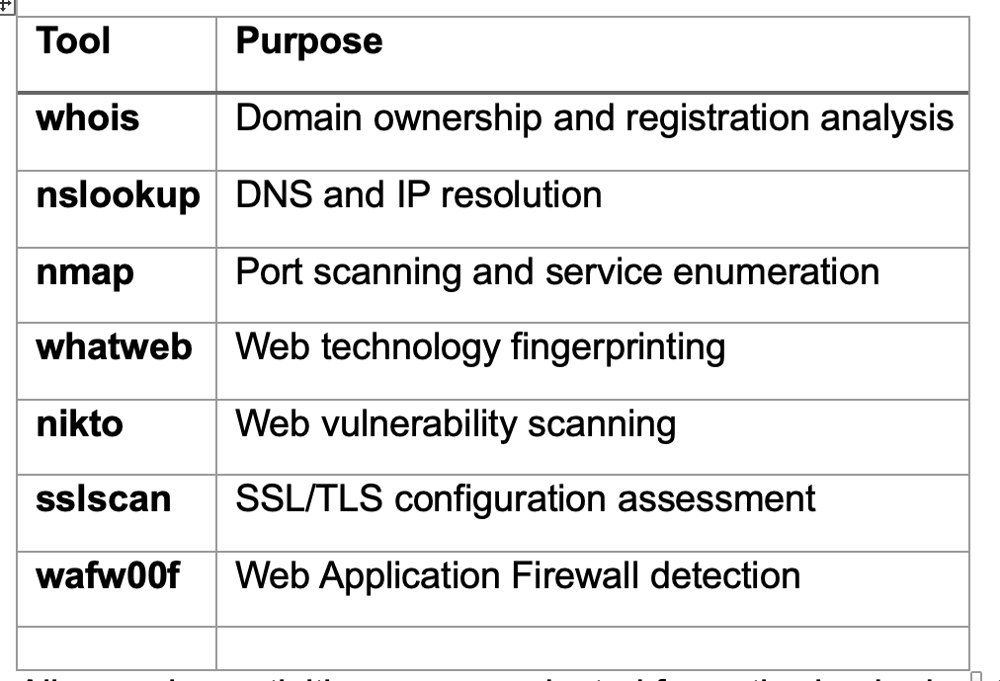
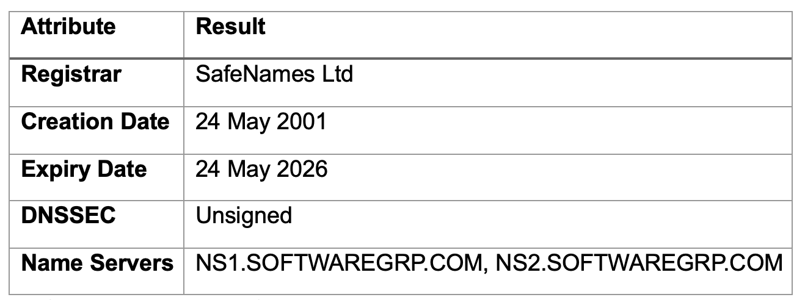
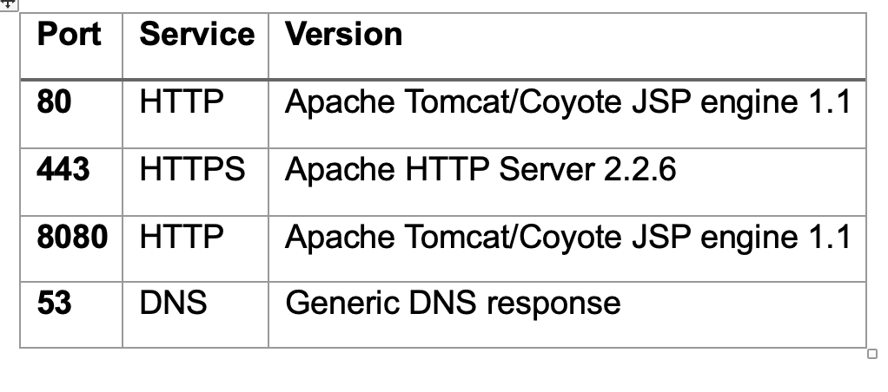
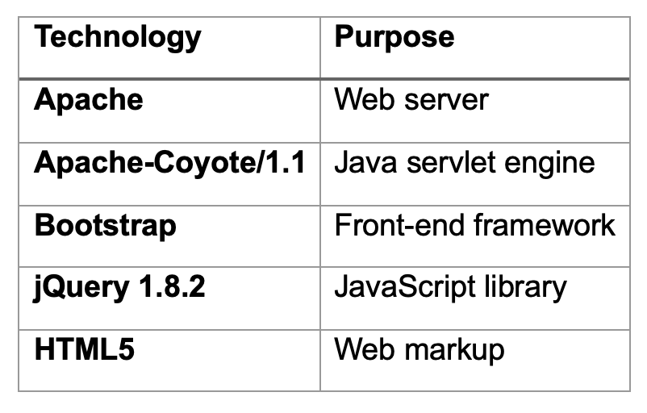
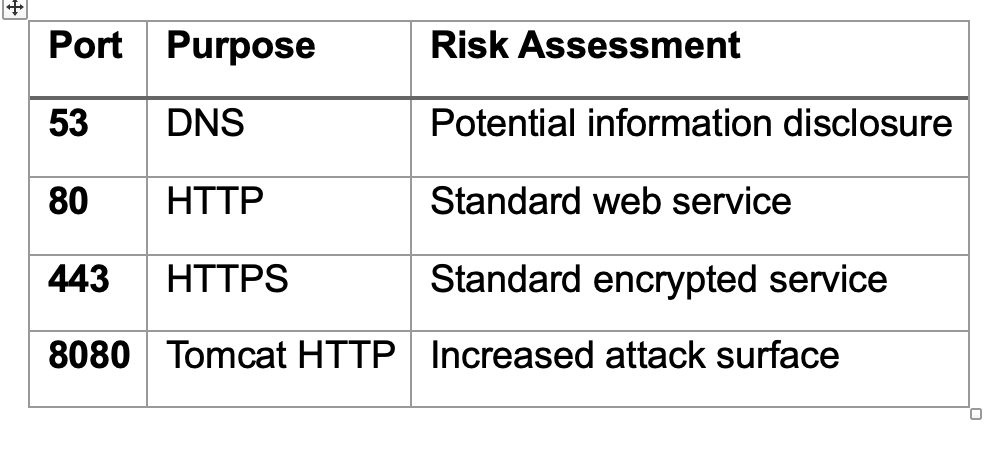
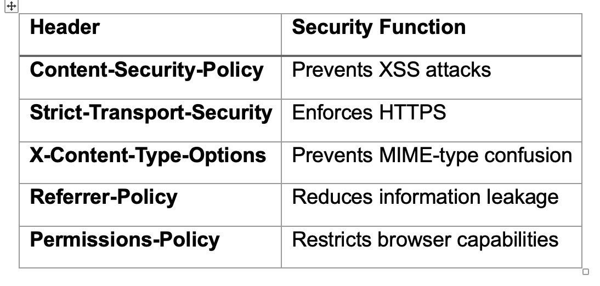
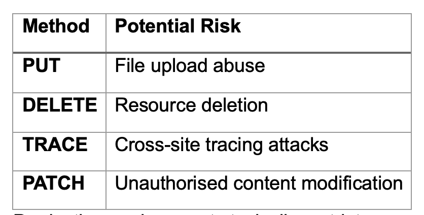
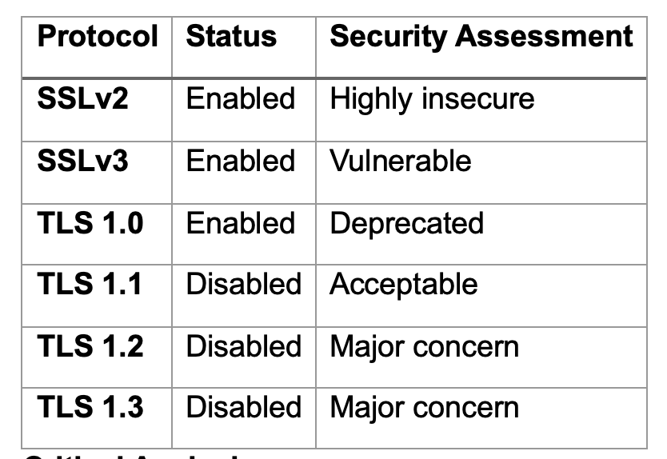
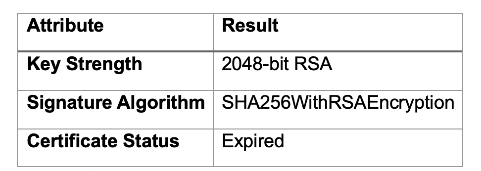
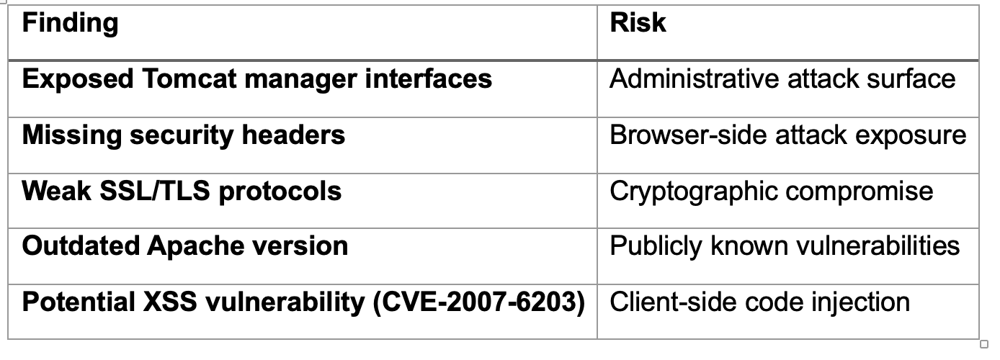

Unit4 Scanning and Collaborative Wiki Activity:

Instructions

Perform scans against your assigned website(s) using the tools available in Kali Linux. Answer as many of the following questions as you can:

What Operating System does the website utilise?
What web server software is it running?
Is it running a CMS (Wordpress, Drupal, etc?)
What protection does it have (CDN, Proxy, Firewall?)
Where is it hosted?
Does it have any open ports? Which did you expect to be open?
Does the site have any known vulnerabilities?
What versions of software is it using? Are these patched so that they are up to date?
The wiki should consist of two sections:

The first section should be a FAQ (frequently asked questions) where you can post questions. In addition, if you have encountered and solved any of the questions/ issues, you should post your responses to the queries.
The second section involves the results - each of you should post a compilation of the results they have obtained in the wiki. Doing so will allow your fellow students to evaluate the kind of results available and ask questions (in the FAQ section) about how certain results were obtained. Offer constructive feedback on the results posted.
For advice on constructive feedback and understanding other peoples' points of view, look at the guidelines on the Department’s homepage on peer review.

Learning Outcomes

Identify and analyse security threats and vulnerabilities in network systems and determine appropriate methodologies, tools and techniques to manage and/or solve them.
Design and critically appraise computer programs and systems to produce solutions that help manage and audit risk and security issues.
Gather and synthesise information from multiple sources (including internet security alerts and warning sites) to aid in the systematic analysis of security breaches and issues.
Reflection

Reflect on this activity by answering the following questions:

Did you have any issues or challenges with the scans?
How did you overcome them?
How will they affect your final report?

________

Target Website
Zero WebApp Security
 
1. Introduction
This report presents the results of a reconnaissance and vulnerability assessment conducted against the target web application using Kali Linux security tools. The purpose of the exercise was to identify technologies, services, configurations, and potential vulnerabilities associated with the website while applying ethical and non-intrusive information gathering techniques.
The assessment focused on:
•	operating system identification
•	service enumeration
•	web technology fingerprinting
•	open port analysis
•	SSL/TLS configuration assessment
•	web vulnerability scanning
•	defensive security controls
The activity demonstrates the use of cybersecurity methodologies and tools to analyse potential threats and vulnerabilities within networked systems.
 
2. Methodology

The assessment combined passive and active reconnaissance techniques. Passive techniques gathered publicly available information, while active techniques performed controlled scanning and service enumeration.
The following tools were used within the Kali Linux environment:

	
All scanning activities were conducted for authorised educational purposes only.
 
3. Domain and Hosting Information

A WHOIS lookup was performed against the parent domain.

DNS enumeration identified the target IP address as:
54.82.22.214
Nmap reverse DNS records further revealed:
ec2-54-82-22-214.compute-1.amazonaws.com
indicating probable hosting within Amazon Web Services infrastructure.

Critical Analysis

Cloud hosting platforms such as AWS improve scalability, availability, and resilience. However, cloud-based environments require strong configuration management because publicly exposed services and misconfigured resources may significantly increase attack exposure.
Additionally, the domain was identified as DNSSEC unsigned, meaning DNS responses are not cryptographically validated. This could theoretically increase exposure to DNS spoofing or cache poisoning attacks.
 
4. Operating System Identification

Operating system identification was conducted using Nmap and corroborated using Nikto.
Findings
Nikto identified evidence of:
Apache/2.2.6 (Win32)
suggesting the system is likely Windows-based.
Critical Analysis
Operating system fingerprinting is not always completely reliable because some servers intentionally suppress or manipulate identifying information. However, multiple tools consistently identified Win32-related components, increasing confidence in the assessment.
Legacy Windows-based web server environments may present additional security concerns if patch management practices are insufficient.
 
5. Web Server and Technologies

Nmap Service Detection Results

WhatWeb Fingerprinting Results
The following technologies were identified:

Critical Analysis

The Apache HTTP Server version identified during scanning was:
Apache HTTP Server 2.2.6
Apache 2.2.x is considered obsolete and has reached end-of-life status. Unsupported software versions are particularly dangerous because they may contain publicly documented vulnerabilities that no longer receive security patches.
Similarly, the detected jQuery version (1.8.2) is outdated and may contain vulnerabilities associated with client-side scripting attacks such as cross-site scripting (XSS).
The use of outdated software demonstrates poor patch management practices, which remain a major cause of successful cyberattacks.
 
6. Open Ports and Services

Nmap Scan Results
sudo nmap -sV zero.webappsecurity.com
Open Ports Identified

Critical Analysis

Ports 80 and 443 are expected for a public-facing web application. However, the exposure of port 8080 may present additional risks because Tomcat management services are frequently targeted by attackers.
Nikto additionally identified administrative interfaces including:
/manager/html
/manager/status
/admin/index.html
Exposed management interfaces increase reconnaissance opportunities and may provide pathways for authentication attacks or administrative compromise.
 
7. Security Headers and HTTP Configuration

Nikto identified multiple missing HTTP security headers.
Missing Headers

Critical Analysis

Missing security headers weaken browser-side security protections and increase susceptibility to several client-side attacks.
For example:
•	absent Content Security Policy headers may increase XSS risk
•	missing HSTS weakens HTTPS enforcement
•	absent X-Content-Type-Options may enable MIME sniffing attacks
Although missing headers do not directly prove compromise, they represent poor security hardening practices.

 
8. Dangerous HTTP Methods

Nikto identified several enabled HTTP methods:
GET, HEAD, POST, PUT, DELETE, TRACE, OPTIONS, PATCH
Critical Analysis

Production environments typically restrict unnecessary HTTP methods to reduce attack exposure.
 
9. SSL/TLS Security Analysis

SSL/TLS analysis was conducted using SSLScan.
Command Used
sslscan zero.webappsecurity.com
 
Supported Protocols

Critical Analysis

The support for SSLv2 and SSLv3 represents a serious security weakness because both protocols are deprecated and vulnerable to cryptographic attacks such as:
•	POODLE
•	downgrade attacks
•	weak cipher exploitation
The absence of TLS 1.2 and TLS 1.3 significantly weakens encrypted communications because modern secure systems rely on these protocols for strong transport security.
 
10. Weak Cipher Suites

SSLScan identified multiple insecure cipher suites including:
RC4
MD5
EXPORT-grade ciphers
Critical Analysis
Weak cryptographic algorithms such as RC4 and MD5 are deprecated due to known vulnerabilities.
Export-grade encryption is particularly insecure because it intentionally reduces encryption strength and can be broken using modern computing power.
The use of weak ciphers significantly increases susceptibility to interception and cryptographic attacks.
 
11. TLS Compression and Renegotiation Issues

Findings
SSLScan reported:
Compression enabled (CRIME)
and
Insecure session renegotiation supported
Critical Analysis
TLS compression vulnerabilities may expose encrypted session data through side-channel attacks such as CRIME. Insecure session renegotiation can also facilitate man-in-the-middle attacks where malicious traffic is injected into encrypted sessions.
These findings indicate weak cryptographic configuration management.
 
12. SSL Certificate Analysis

The SSL certificate was issued by:
DigiCert
Findings

The certificate expired in:
May 4 2022
Critical Analysis
Expired certificates undermine user trust and may expose systems to interception risks. Certificate lifecycle management is a critical component of secure web infrastructure maintenance.
 
13. Potential Vulnerabilities Identified

Nikto identified several potentially vulnerable configurations.
Examples

Critical Analysis
The presence of outdated software versions increases the likelihood that publicly documented vulnerabilities may remain exploitable. However, automated vulnerability scanners can generate false positives, meaning findings should be validated manually before conclusions regarding exploitability are made.
 
14. Web Application Firewall Detection

WAF detection was performed using WAFW00F.
Command Used
wafw00f http://zero.webappsecurity.com
Findings
No WAF detected
Critical Analysis
The absence of a detectable Web Application Firewall may simplify reconnaissance and increase exposure to automated attacks such as:
•	SQL injection
•	brute-force attacks
•	cross-site scripting
•	malicious scanning
However, some defensive technologies intentionally avoid fingerprinting detection, therefore absence of detection does not definitively prove absence of protection.
 
15. Reflection

Several challenges were encountered during the reconnaissance and vulnerability assessment process.
Firstly, service fingerprinting results varied slightly across tools. For example, some scans identified Apache-Coyote while others revealed Apache HTTP Server components. This demonstrated the limitations of relying solely on automated reconnaissance tools because banner obfuscation and proxy configurations may affect accuracy.
Secondly, vulnerability scanning produced numerous informational findings alongside potentially serious issues. Distinguishing between genuine vulnerabilities, configuration weaknesses, and false positives required critical interpretation and cross-referencing across multiple tools including Nmap, Nikto, SSLScan, and WhatWeb.
These challenges were overcome by correlating evidence from multiple independent sources rather than relying on a single scanner result. Additional analysis using publicly available vulnerability databases and security guidance improved confidence in the findings.
The activity will positively influence the final report because it reinforced the importance of:
•	layered reconnaissance methodologies
•	critical interpretation of automated scan results
•	vulnerability validation
•	secure configuration management
•	defence-in-depth security principles
The exercise also highlighted how outdated software, weak cryptographic protocols, and poor configuration management significantly increase organisational cybersecurity risk.
 
16. Conclusion

The reconnaissance and vulnerability assessment identified numerous security weaknesses within the target web application environment.
The server appeared to use outdated technologies including Apache HTTP Server 2.2.6 and legacy cryptographic protocols such as SSLv2 and SSLv3. Multiple insecure cipher suites were enabled, the SSL certificate had expired, and several recommended HTTP security headers were absent.
Additional concerns included exposed administrative interfaces, potentially dangerous HTTP methods, weak TLS configuration, and the absence of detectable web application firewall protection.
Nevertheless, the exercise also demonstrated the limitations of automated security tools. Findings generated by scanners require careful validation and contextual analysis before conclusions regarding exploitability can be drawn.

Overall, the assessment highlighted the importance of:
•	regular patch management
•	secure protocol configuration
•	strong encryption standards
•	secure access controls
•	layered defensive technologies
•	continuous monitoring and vulnerability assessment
in protecting modern web applications against evolving cybersecurity threats.
 
References

Apache Software Foundation (2024) Apache HTTP Server Documentation. Available at:

Apache HTTP Server Documentation.

MITRE (2024) CVE Database. Available at:
MITRE CVE Database.

NIST (2024) National Vulnerability Database. Available at:

NIST National Vulnerability Database.

OWASP (2024) HTTP Security Response Headers Cheat Sheet.

OWASP HTTP Security Response Headers Cheat Sheet.

OWASP (2024) Transport Layer Protection Cheat Sheet. 

OWASP Transport Layer Protection Cheat Sheet.

Scarfone, K. and Mell, P. (2024) Guide to Intrusion Detection and Prevention Systems. National Institute of Standards and Technology. Available at:
NIST Cybersecurity Publications.

